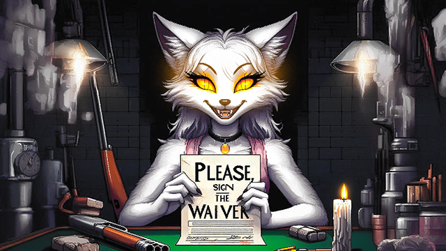

# Buckshot Roulette 🔫

  

    

Buckshot Roulette is a Python text-based game where players engage in a deadly game of chance and strategy. Buckshot Roulette isn't your normal roulette game: join game with a 12-gauge shotgun, turning Russian Roulette into a high-stakes gamble for survival. The game mechanics are based on [Buckshot roulette by Mike Klubnika](https://store.steampowered.com/app/2835570/Buckshot_Roulette/)

## Table of Contents

- [Introduction](#introduction)
- [Features](#features)

## Introduction

Welcome to Buckshot Roulette! Here's a quick guide to the game:

Find the bot [@karo_buckshot_roulette_bot](https://t.me/karo_buckshot_roulette_bot) in telegram;

1. Create/Join a Room:
   - To start, create a room with `/join` command and get the code.
   - If you have a code, simply use `/join 123456` to join an existing room.
   - Use the `/find` command to find the game (you may have to wait).

2. Initiate the Game:
   - The game kicks off with a coin toss to determine who goes first.
   - The objective is to eliminate your opponent before they eliminate you!

3. Health Points and ammo:
   - Both players start with an equal amount of **⚡️HP⚡️**, randomly generated.
   - At the beginning of each round, a random mix of **💥live💥** and **🫧blank🫧** rounds is loaded into the shotgun.

4. Gameplay:
   - Players take turns making moves.
   - You can either **🔼shoot your opponent🔼**, passing the turn to them, or **🔽shoot yourself🔽**, gaining the next move if the shot is **🫧blank🫧**.

5. Items for Strategy:
   - Use items strategically before shooting:
      - **🔗Handcuffs**: Force your opponent to skip their next move.
      - **🚬Cigarette**: Restore **1⚡️HP⚡️** to yourself.
      - **🍺Beer**: Remove one loaded cartridge from the shotgun.
      - **🪚Saw**: Double the shotgun's damage for one turn.
      - **🔍Magnifying Glass**: Identify one currently loaded cartridge in the shotgun.
      - **📞Phone**: Allows you to find out the value of a random shell in the loadout.
      - **💊Spoiled pills**: Can heal you by  **2⚡️HP⚡️** with a 40% chance, otherwise it will hurt you by **1⚡️HP⚡️**.
      - **🔀inverter**: Replaces all blank with live and all live with blank.
      - **💉Adrenaline**: Allows you to use one of your opponent's items. But hurry up, the time to choose is limited!

Keep a keen eye, plan your moves wisely, and aim for victory in Buckshot Roulette!

## Features

- **Turn-Based Gameplay:** The game operates on a turn-based system, allowing players to take actions one at a time.
- **Item Management:** Players can collect and use various items, each with its own unique effects and strategic implications.
- **Health Points (HP):** The game includes a health points system, adding a layer of survival and strategy to the gameplay.
- **Randomized Elements:** The distribution of items and other game elements is randomized, ensuring each game is a unique experience.
- **Player Interaction:** Players can engage in interactions such as shooting, tying, and using items on each other.
